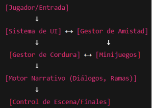

Technical Design Document (TDD) – *Lost Echoes*

## **1. Lista de características obtenidas del GDD**
Las principales características del juego derivadas del Game Design Document son:

- **Género y estilo:** Aventura narrativa con elementos RPG y mecánicas de gestión de cordura.
- **Plataforma inicial:** PC (con posibilidad de port a consolas en etapas futuras).
- **Sistema de relaciones:** Mecánica de amistad con valores cuantificables (+1, 0, -1) que determina el desarrollo narrativo y los finales.
- **Gestión de cordura:** Barra de cordura (0–10) asociada a minijuegos de memoria nocturnos, con consecuencias directas en la narrativa y la dificultad.
- **Decisiones narrativas ramificadas:** Opciones de diálogo y elecciones que afectan la afinidad con personajes y el desenlace del juego.
- **Personajes principales:** El aprendiz (jugador), tres compañeros (guerrero, maga, druida), un mentor y la Hidra Falsa como antagonista.
- **Finales múltiples:** Seis finales posibles más un “Game Over” por pérdida total de cordura.
- **UI:** Indicador de cordura visible, indicador de amistad oculto, sistema de diálogos con retratos e ilustraciones.
- **Estilo visual y narrativo:** Fantasía oscura, ilustraciones estáticas tipo novela visual, música ambiental mística y efectos sonoros para reforzar atmósfera.
-----
## **2. Elección de Game Engine**
Se propone el uso de **Unity** como motor de desarrollo principal, debido a:

- **Versatilidad narrativa:** Integración con frameworks de novelas visuales y sistemas de diálogo (ej. Ink, Fungus).
- **Soporte para minijuegos personalizados:** Permite implementar los juegos de memoria y mecánicas de cordura de manera modular.
- **UI flexible:** Facilita la creación de interfaces dinámicas para indicadores de cordura y amistad.
- **Multiplataforma:** Exportación sencilla a PC y posibilidad de portar a consolas.
- **Ecosistema:** Amplio soporte de librerías para audio, efectos visuales y shaders que refuercen la estética oscura.
## **3. Planeación (Diagrama de Gantt)**
Cronograma estimado de 6 meses:

|Fase|Duración|Actividades principales|
| :- | :- | :- |
|Preproducción|1 semanas|Documentación, prototipado narrativo, diseño de mecánicas básicas.|
|Diseño narrativo|1 semanas|Creación de guiones, diálogos y ramificaciones.|
|Implementación inicial|2 semanas|Desarrollo del sistema de amistad, cordura, UI y minijuego de memoria.|
|Integración artística|2 semanas|Inserción de ilustraciones, efectos visuales y música.|
|Pruebas y ajustes|1 semanas|Testing de narrativa ramificada, balance de cordura/amistad, optimización de UI.|
##
##
##
##
##
## **4. Diagramas de alto nivel**
Arquitectura de software (alto nivel)

## **5. Herramientas de arte**
- **Ilustraciones y retratos:** Clip Studio Paint, Photoshop.
- **Modelado 3D (objetos/entornos simples):** Blender.
- **Texturas y edición:** Substance Painter, Krita.
- **Efectos visuales y partículas:** Unity Shader Graph y VFX Graph.
## **6. Objetos 3D, Terreno y Escenas**
- **Objetos 3D:** Uso moderado, enfocados en elementos ambientales y escenografía.
- **Terrenos:** Fondos pre-renderizados o pintados, reforzando el estilo de novela visual.
- **Escenas:** Organizadas en capítulos narrativos (campamento, bosque, confrontación final).
## **7. Detección de colisiones, físicas e interacciones**
- **Colisiones:** Unity Physics2D para minijuegos interactivos (símbolos de memoria, selección de opciones).
- **Física:** Implementación mínima, dado que el núcleo es narrativo.
- **Interacciones:** Scripts personalizados para decisiones, gestión de amistad y cordura.
## **8. Lógica de juego e inteligencia artificial**
- **Gestión narrativa:** Árbol de decisiones controlado por motor narrativo (Ink/JSON).
- **Amistad y cordura:** Variables persistentes actualizadas en tiempo real según elecciones.
- **IA de personajes:** No se contempla una IA compleja; los personajes actúan en base a guiones y disparadores narrativos.
## **9. Networking (si aplica)**
En la versión inicial no se contempla componente multijugador.\
` `En futuras iteraciones, podría explorarse un **modo cooperativo narrativo online**, sincronizando estados de amistad y cordura entre jugadores vía Photon o Netcode for GameObjects (Unity).
## **10. Audio y efectos visuales**
- **Música ambiental:** Creada en FL Studio o Ableton, con instrumentación mística y oscura.
- **Efectos sonoros:** Librerías como Boom Library o Soundly, integradas mediante FMOD o Wwise.
- **Efectos visuales:** Distorsiones visuales en UI y escenas al reducir cordura (shaders, post-procesado).
## **11. Plataforma y requerimientos de software**
**11. 1 Plataforma inicial:** PC (Windows 7, 8, 10, 11).

**11.2 Requerimientos mínimos:**\

- CPU: Intel core duo.
- RAM: 2 GB.
- GPU: Gráficos Integrados.
- Almacenamiento: 5 GB.
- Direct X version 9, 10, 11.

**11. 3 Requerimientos recomendados:**\

- CPU: Intel core i3.
- RAM: 4 GB.
- GPU: Gráficos Integrados.
- Almacenamiento: 5 GB.
- Direct X version 9, 10, 11.

